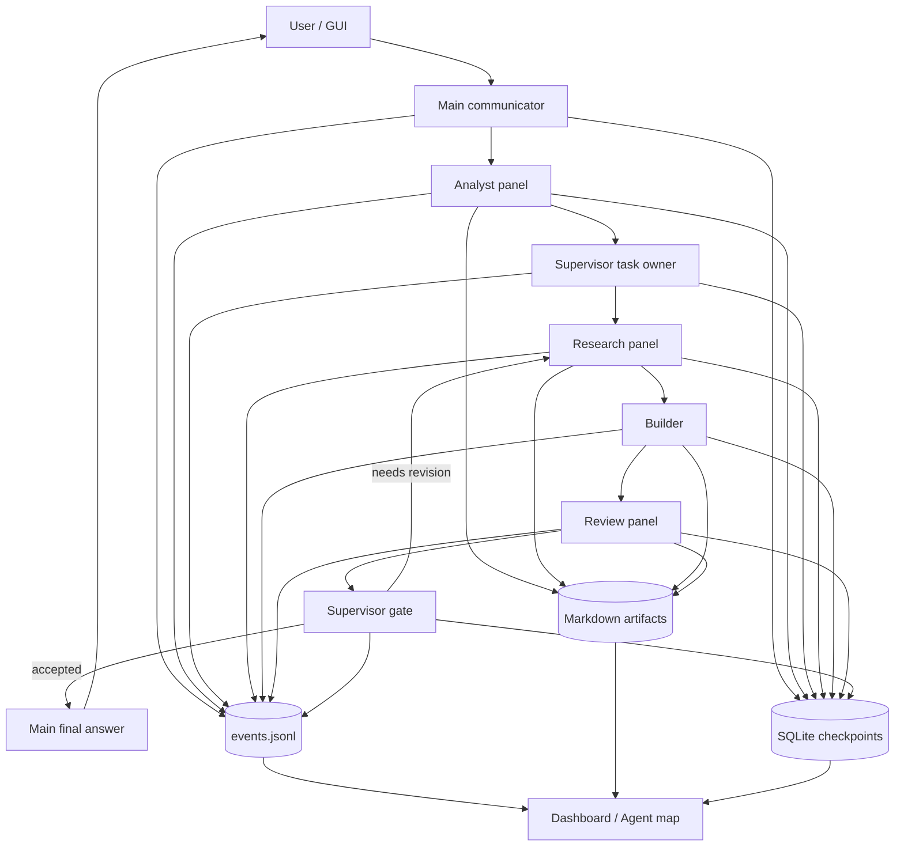
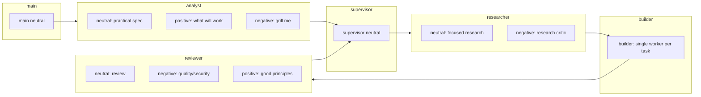
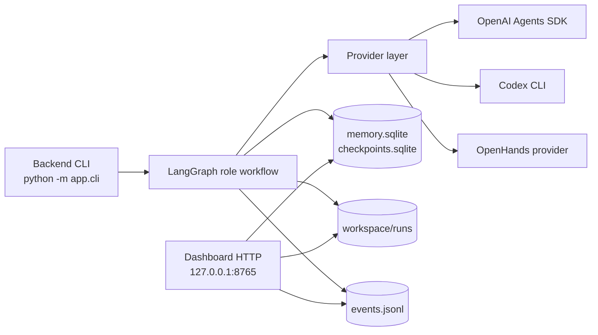

# Multiagent Swarm Architecture

## Design Inputs

The runtime follows these external design signals:

- LangGraph persistence/checkpointing: graph state should be saved after node execution so workflows can recover and resume.
- OpenAI Agents SDK: agents should be specialized, support handoffs/tools/guardrails, and produce traceable runs.
- OpenTelemetry GenAI conventions: agent/model/tool activity should be observable as spans/events with consistent names.

## Runtime Layers

## Role Model

## Backend And GUI Split

## Checkpoint Strategy

Each role node writes a checkpoint into `workspace/checkpoints.sqlite` after it returns state. The checkpoint stores:

- `run_id`
- graph node name
- JSON-safe state snapshot
- timestamp

This is intentionally separate from memory. Checkpoints are for recovery and replay. Memory is for future prompt context.

## Quality Gate

The reviewer panel returns neutral, negative/security, and positive quality opinions. The supervisor gate then checks:

- whether the plan was executed,
- whether tests or TDD/BDD evidence exists for code tasks,
- whether reviewer issues require another pass.

If quality or gate says `needs_revision`, the graph loops back to research/build until `max_review_retries` is reached.
