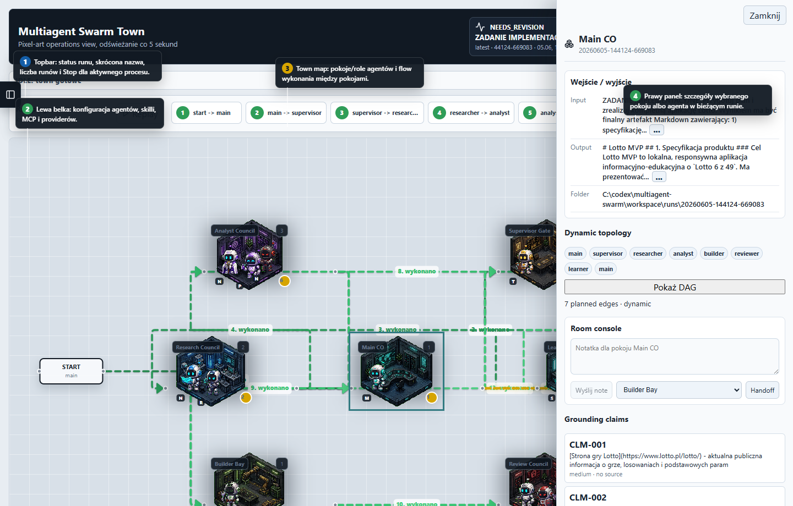
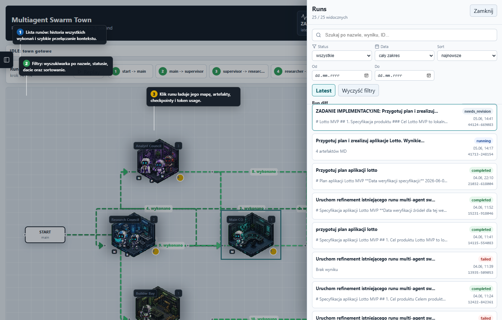
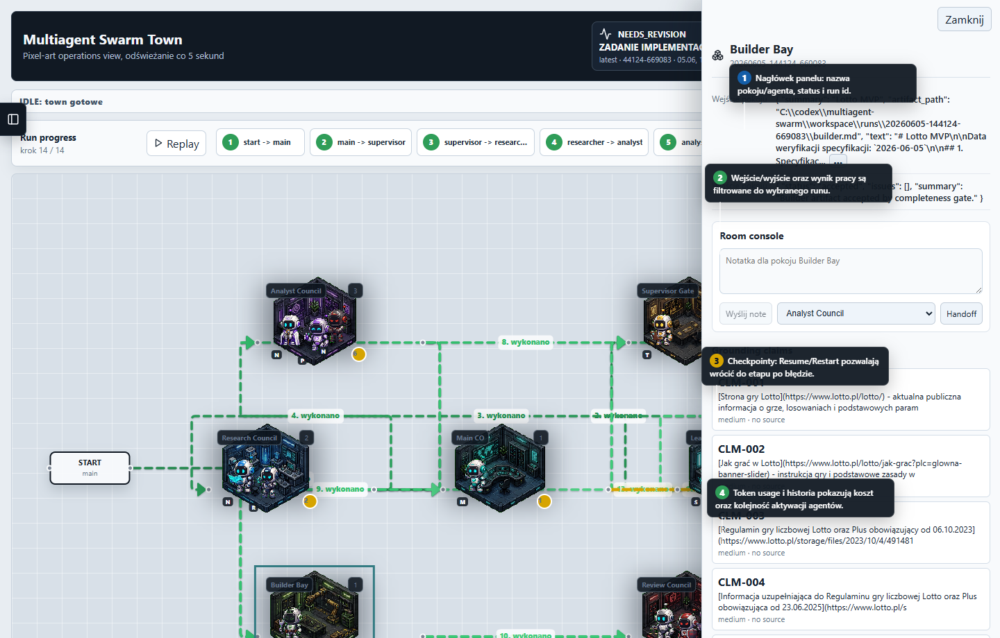
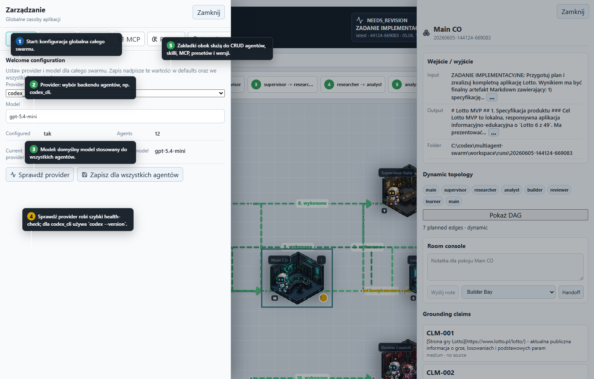
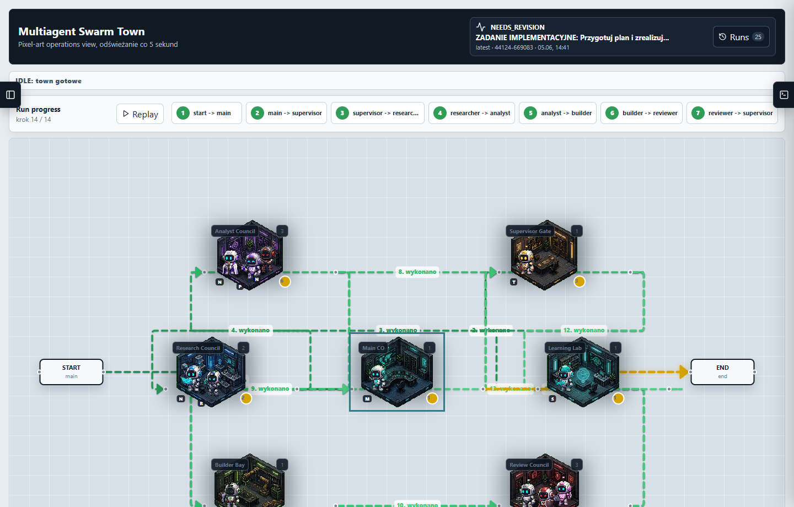

# Multiagent Swarm GUI - instrukcja po ekranach

Ten katalog zawiera screeny instruktażowe dashboardu `/town`.

## 1. Widok główny town

1. Topbar pokazuje aktualny status runu, nazwę zadania, listę runów i przycisk Stop dla aktywnego procesu.
2. Lewa belka otwiera zarządzanie konfiguracją agentów, skilli, MCP i providerów.
3. Mapa town pokazuje pokoje/role agentów oraz flow wykonania między pokojami.
4. Prawy panel pokazuje szczegóły wybranego pokoju albo agenta w bieżącym runie.

## 2. Lista runów

1. Panel Runs pozwala przełączać się między historycznymi runami.
2. Filtry pozwalają szukać po nazwie, statusie, dacie i sortowaniu.
3. Kliknięcie runu ładuje jego mapę, artefakty, checkpointy i token usage.

## 3. Prawy panel szczegółów

1. Nagłówek pokazuje nazwę pokoju/agenta, status i run id.
2. Sekcja wejście/wyjście pokazuje dane tylko dla bieżącego runu.
3. Checkpointy pozwalają wykonać Resume albo Restart review.
4. Token usage i historia pokazują koszt oraz kolejność aktywacji agentów.

## 4. Konfiguracja i onboarding

1. Start to konfiguracja globalna całego swarmu.
2. Provider wybiera backend agentów, np. `codex_cli`.
3. Model ustawia domyślny model dla wszystkich agentów.
4. Sprawdź provider wykonuje szybki health-check; dla `codex_cli` używa `codex --version`.
5. Zakładki obok służą do CRUD agentów, skilli, MCP, presetów i wersji.

## 5. Sam town bez paneli bocznych

Ten widok pokazuje mapę town z zamkniętymi panelami bocznymi. Przydaje się do prezentacji flow runu, układu pokojów i progresu checkpointów bez rozpraszających szczegółów.
